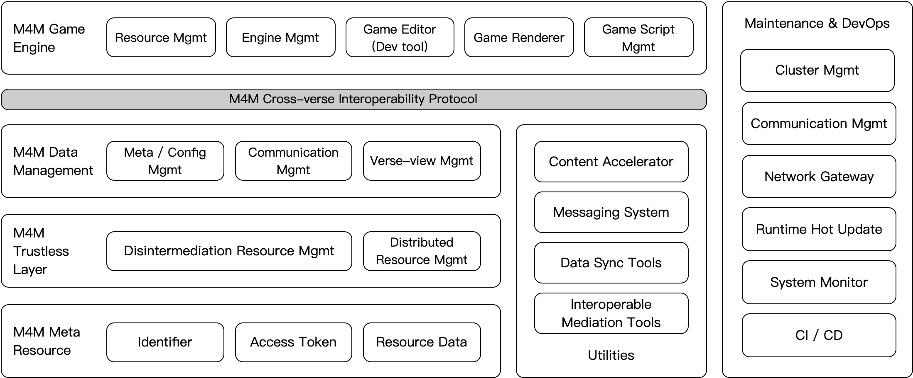
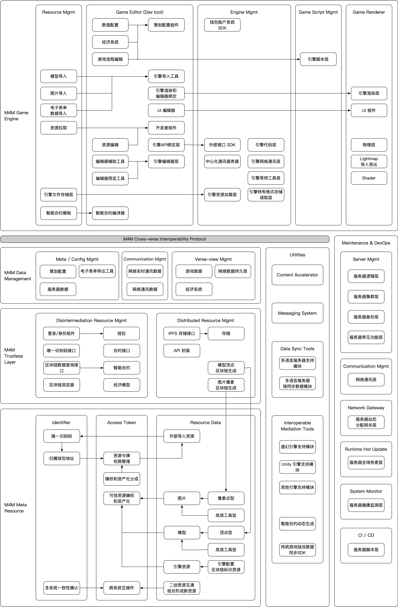

# Engine Documentation

Meta4D.Me engine is an infrastructure for trustless identity presentation cross-verse, and provides capability for identity interoperability within different worldview.

Tech overview demostrates all components inside M4M engine from end to end. 

