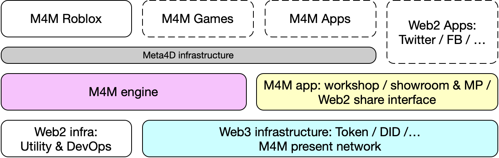

# Home

**Meta4D.Me (M4M) engine** is part of [M4M project](https://docs.meta4d.me/).&#x20;

M4M project is an open source project for digital twins' presentation cross extended reality (XR) systems or metaverses, from time to time.

M4M engine is an infrastructure for trustless identity presentation cross-verse, and provides capability for identity interoperability within different worldview.

The initial presentation service M4M provides is for identity outlook cross XR systems or metaverses. For the identity outlook service, M4M engine turns to be an open-source game engine with interoperable skin module and collaborative physics drivers.

### Technical overview

M4M engine uses traditional Web2 technology to build close-loop verse applications, uses Web3 trustless infrastructure to enable open-loop identity recognition and cross-verse interoperability.

* M4M core. Combines Web2 with Web3 technology together, provides support for cross-verse M4M engine.
  * **M4M meta resource**. Enables static resource management, including standard identifier for cross-verse entity/identity recognition, token model for cross-verse access control, and common data management of storage and privacy control.
  * **M4M trustless layer**. Enables runtime data access control for cross-verse interoperability, including disintermediation of AAA (authentication, authorization and accounting) for self-sovereign data, and open-loop storage capability.
  * **M4M data management**. Basic data management for M4M game engine, to combine Web2 resource with Web3 data, Web2 technique for high performance and Web3 for access control.
* **M4M cross-verse interoperability protocol**. Protocol series to support open-loop identity presentation cross verse applications, including object abstraction, syntactic mediation, and semantic mediation. Identity data presentation based on the protocol will be used in collaborative physics drivers of M4M game engine.
* **M4M game engine**.&#x20;
* Miscellaneous.
  * **Utilities**. Web2 and Web3 utilities been used in M4M core and engine.
  * **Maintenance and DevOps**. Runtime components for engine maintenance and its consumers (games).

### Engine components

Component overview demonstrates all components inside M4M engine from end to end.

